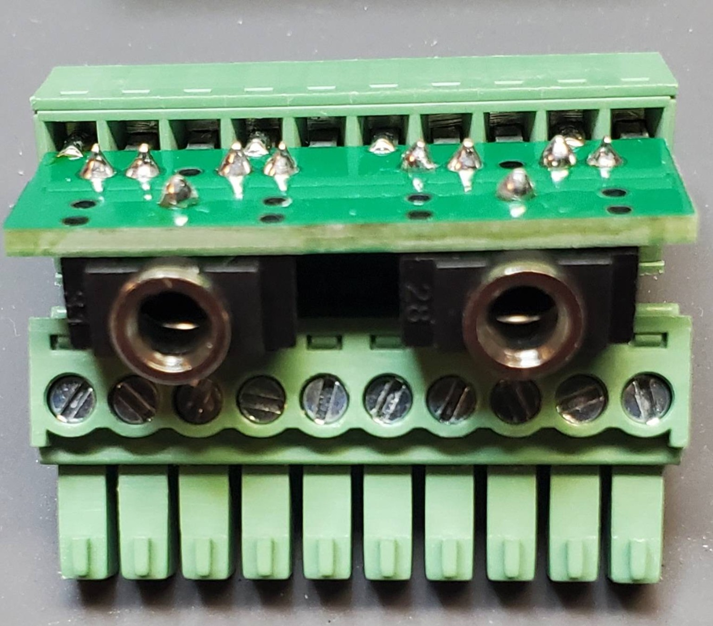
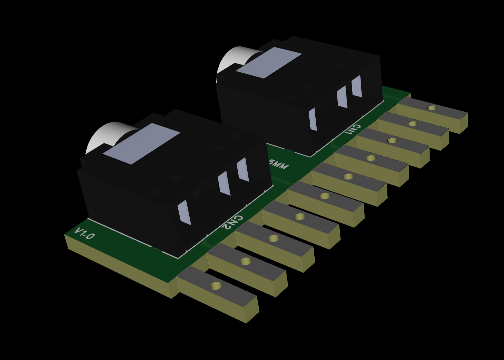
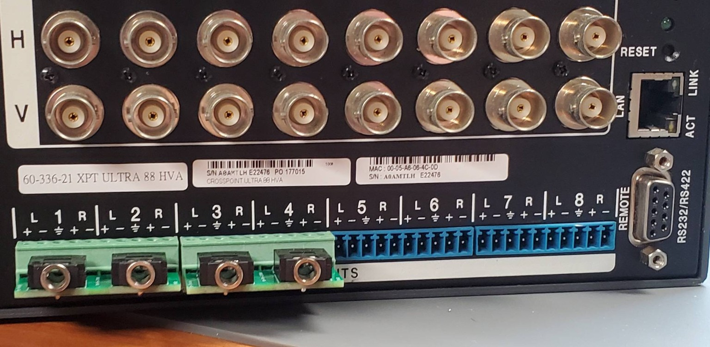
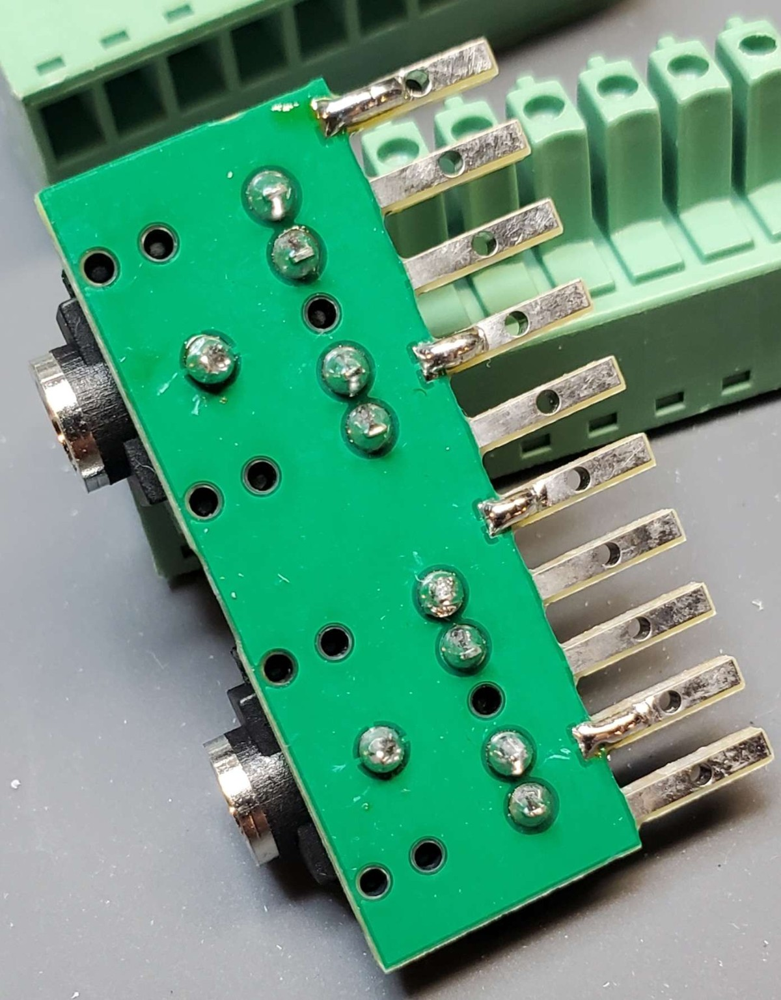
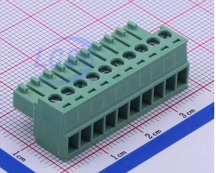
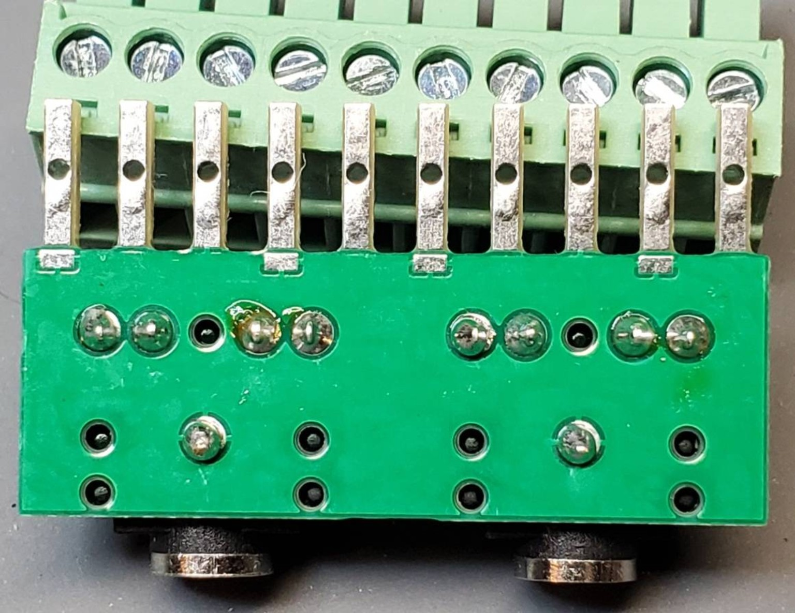

# 10-Pin Phoenix Audio Adapter

A 10-pin Phoenix audio adapter designed for Extron CrossPoint matrix switchers.

*Assembled adapter with the mating 10-pin Phoenix connector installed.*

*PCB render. The mating 10-pin Phoenix connector is not shown.*

## Why a 10-Pin Connector?

Conventional Phoenix audio adapters typically use 5-pin connectors intended for individual 5-pin receptacles. Extron CrossPoint units instead use 10-pin female Phoenix receptacles for their audio connections.

Extron's original 5-pin connectors were custom, slimmer parts designed to fit side by side in a 10-pin receptacle. Standard replacement 5-pin connectors are wider and often have to be trimmed or sanded to fit correctly.

This design uses a single 10-pin connector, so the connector sides do not need to be trimmed or sanded.

*Four assembled adapters installed side by side on an Extron CrossPoint Ultra 88 HVA.*

## Features

- Single 10-pin connector matching the receptacle format used by Extron CrossPoint units
- No trimming or sanding required
- Avoids the fit problems associated with two conventional 5-pin connectors
- Configurable for input or output use with solder jumpers
- Intended as a practical replacement for difficult-to-source Extron-style slim connectors

*Angled view of the assembled adapter and connector pins.*

## Bill of Materials

### Phoenix Connector

- **Recommended part:** [JILN JL15EDGK-35010G01 — LCSC C409110](https://www.lcsc.com/product-detail/C409110.html)
- **Positions:** 10 (1×10)
- **Pitch:** 3.5 mm
- **Connector type:** Plug

An equivalent connector may be used if it has **10 positions**, **3.5 mm pitch**, and is mechanically compatible with the 10-pin female Phoenix receptacle on the Extron CrossPoint.

*Example of a male 10-position, 3.5 mm-pitch Phoenix-style screw-terminal plug.*

### 3.5 mm to Left/Right RCA Adapter

- **Recommended adapter:** [Coolgear CM-201412BSTK — DigiKey 28168084](https://www.digikey.com/en/products/detail/coolgear/CM-201412BSTK/28168084)

Use one adapter for each 3.5 mm stereo jack when separate left and right RCA connections are required.

## Input and Output Configuration

The adapter includes a GND solder pad beside the negative-terminal pads.

- **Input use:** Bridge the GND pad to both negative terminals with solder.
- **Output use:** Leave both bridges open so the output negative terminals are not connected to ground.

> **Important:** Do not use the input configuration on an output. Shorting the negative terminals of a balanced output to ground may cause improper operation or damage, depending on the output circuit.

*Underside of the assembled adapter in the output configuration, with both solder bridges left open.*

## Fabrication Files

- [Download the Gerber package](Gerber_PCB2_2026-08-17.zip)

The archive contains the Gerber layers and plated/non-plated drill files needed for PCB fabrication.

> **Verification:** A physical board has been assembled and test-fitted as shown above. Review the files with your PCB manufacturer's viewer and verify the dimensions, pinout, jumper configuration, and electrical connections before ordering or connecting the adapter to equipment.

## Photo Credit

**All prototype photographs in this repository were provided by sg17.**

## License

Unless otherwise stated, the hardware design, fabrication files, and documentation in this repository are licensed under the [CERN Open Hardware Licence Version 2 – Permissive](LICENSE) (`CERN-OHL-P-2.0`).

This permits use, modification, distribution, and manufacture—including commercial use—subject to the licence's notice requirements. The design is provided without warranty.

Copyright © 2026 ihategravel2.
